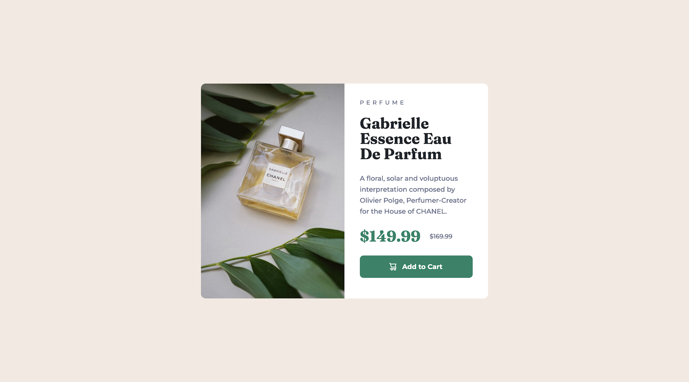
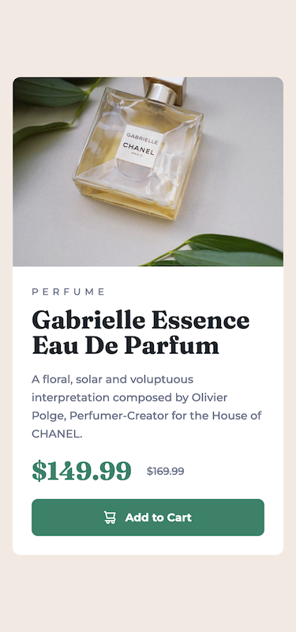

# Frontend Mentor - Product preview card component solution

This is a solution to the [Product preview card component challenge on Frontend Mentor](https://www.frontendmentor.io/challenges/product-preview-card-component-GO7UmttRfa). 
Frontend Mentor challenges help you improve your coding skills by building realistic projects. 

## Table of contents

- [Overview](#overview)
  - [The challenge](#the-challenge)
  - [Screenshot](#screenshot)
  - [Links](#links)
- [My process](#my-process)
  - [Built with](#built-with)
  - [What I learned](#what-i-learned)
  - [Continued development](#continued-development)
  - [Useful resources](#useful-resources)
- [Author](#author)

## Overview

### The challenge
Users should be able to:
- View the optimal layout depending on their device's screen size
- See hover and focus states for interactive elements

### Screenshot

## My process

### Built with
- Semantic HTML5 markup
- CSS custom properties
- Flexbox

### What I learned
1. I wasn't sure which should I use `<h1>` or `<h2>` about some texts.   
Finally I use the both tag as below, but I haven't understood what the bestpractice yet.   
``<h1>PERFUME</h1>``   
``<h2>Gabrielle Essence Eau De Parfum</h2>``

2. It was a great learning experience how to put a component on center the screen.   
Especially how to center of screen vertically.   
Finally, I used `display:flex` and `align-items:center` without setting height.

### Continued development
When I'm looking back, I have not write my code of Components yet.   
I want to experience more patterns through the Frontend Mentor challenges.

## Author
- Frontend Mentor - [@satokosugimoto](https://www.frontendmentor.io/profile/satokosugimoto)
- Twitter - [@see_ees](https://www.twitter.com/see_ees)
